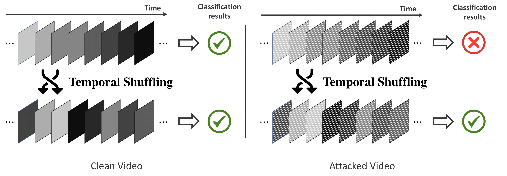

# Temporal Shuffling for Defending Deep Action Recognition Models against Adversarial Attacks

## Introduction

We suggest that action recognition models rely on the motion information less than expected, and thus they are robust to randomization of frame orders. Furthermore, we find that motion monotonicity remaining after randomization also contributes to such robustness.
Based on this observation, we develop a novel defense method using temporal shuffling of input videos against adversarial attacks for action recognition models. Another observation enabling our defense method is that adversarial perturbations on videos are sensitive to temporal destruction.

## Toy experiment to check dependency on spatial information

For testing the dependency of action recognition models on spatial information with controlled environment, we generate three types of datasets including eight-frame-long videos containing a simple object moving in a certain direction on a simple background.

### Toy dataset

We consider eight types of background, eight types of object, and eight motion directions in order to pose an eight-class classification problem in each of three datasets.

 

The motion speed is constant in each video between 3 and 5 pixels per frame. Each dataset contains 1200 training videos and 400 test videos.
Each dataset is generated with different rules:
- Dataset 1: A combination of one type of background, one type of object, and one motion direction is assigned to each class, so that each of the background, object, and motion in a video contains class-relevant information.
- Dataset 2: A combination of one type of object and one motion direction is assigned to each class, while the background is randomly chosen.
- Dataset 3: Each class corresponds to one of the eight motion directions, and the background and object are chosen randomly.

 

Toy datasets are available for download in the toy_dataset folder.

### Toy model

For each dataset, we train a 3D CNN model based on ResNet18 using the Adam algorithm, where the 3&times;3 convolutional layers are inflated to 3&times;3&times;3 convolutional layers.

### Results

 

In the results, when the spatial cues in videos are related to the class labels (i.e., Dataset 1), the models show robust performance.
The largest accuracy drop is observed in Dataset 3 where only temporal cues are class-relevant.
These results also support that the models are trained to exploit spatial cues effectively, so they become robust to temporal destruction.
